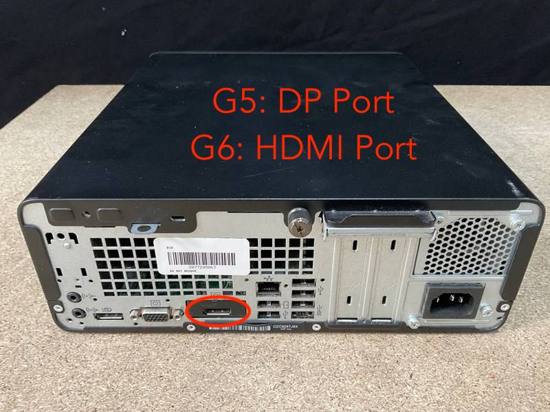
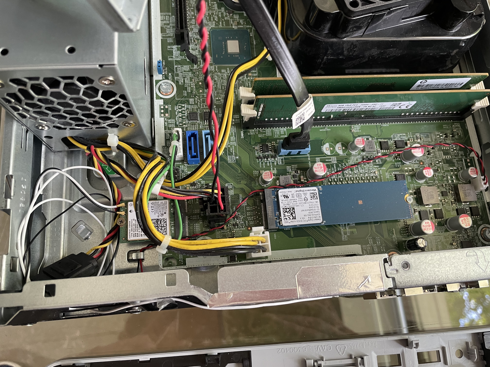

# The Difference Between ProDesk G5 and G6

I own both the ProDesk 400 G5 and G6 and can verify that they come with the same motherboard. The G5 launched with the 8th gen cpus but received an update, 
and I was able to swap a 9th gen core i3 from my G6 machine into my G5 machine and vice versa. The only visible difference between the 2 devices is that the G5 only
has DisplayPort connectors, whereas the G6 has a HDMI port, making it a little more handy for end-users.

## Upgrade Possibilities

You can easily install or swap a 9th gen cpu up to the Core i9-9900.
I am currently running an i5 8500, an upgrade to the original i3 9100.
I installed 16GB of DDR4 memory. Bandwith is capped at 2133.

